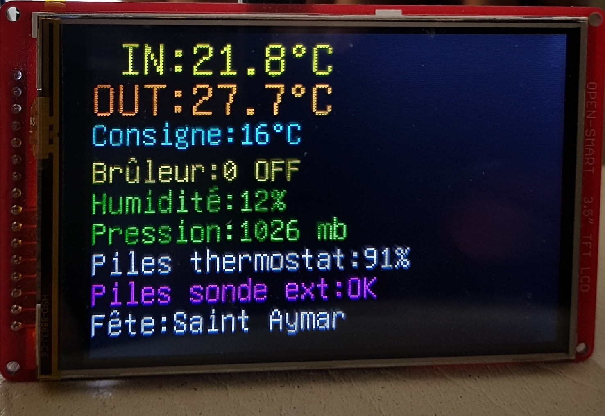
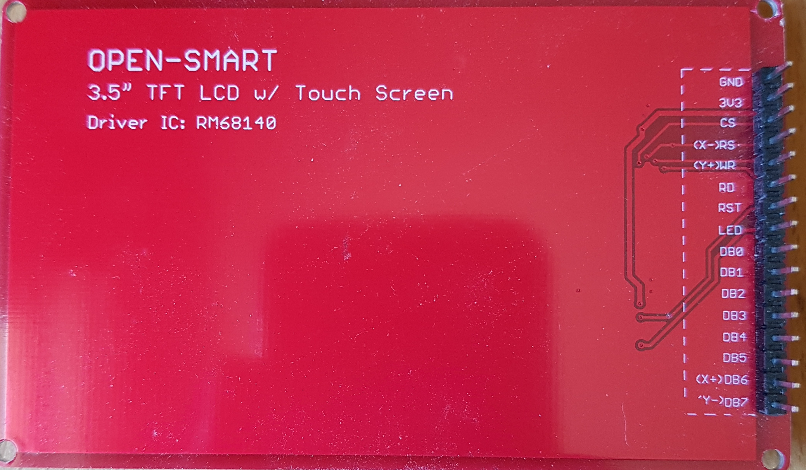
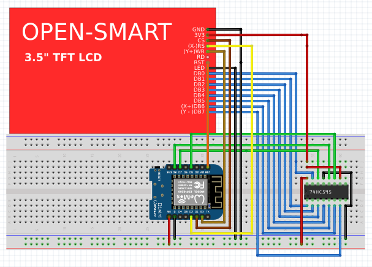

# DR61581

  
  
  
  
  

Ce projet concerne un petit répéteur (voir image ci-dessus), permettant d'afficher des données provenant d'un terminal domotique
Jeedom.
Le répéteur et connecté en wifi à la domotique et interroge ce dernier toutes les 30 secondes. Le serveur Jeedom répond à la requête 
en envoyant les données demandées.

# Afficheur:
C'est un TFT 3.5" 480x320 pixels à commande parallèle 8 bit commandé par un microcontroleur ESP8266.
L'afficheur est muni d'une interface parallèle 8 bit bidirectionnelle ainsi que une interface tactile non utilisée ici. L'utilisation du registre à décalage 74HC595 a été rendue nécessaire ici car le ESP8266 n'a pas assez de GPIO disponibles. De ce fait, l'afficheur est géré en écriture seule.  
Le fabricant commercialise cet afficheur avec plusieurs contrôleurs. Sur l'image ci-dessus, le contrôleur est un RM68140 alors que le logiciel est écrit pour un R61581. Ceci explique la présence d'un répertoire TFT_Drivers avec des fichiers qui varient légèrement d'un contrôleur à l'autre.
L'affichage de caractères accentués latins sont possibles grâce à un fork de la librairie Adafruit_GFX 
https://github.com/joeycastillo/Adafruit-GFX-Library

La classe SPI_595_ESP8266 dérivée de la classe Adafruit-GFX a été créée pour gérer l'afficheur de manière transparente.

# Dans jeedom:
## Deux scripts:  
### SCRIPT 1: ID 276 pour afficheur d'essais  
http://192.168.0.19/datas?IN=#[Ma maison][SRT 323][Température]#&Consigne=#[Ma maison][SRT 323][ConsigneEtat]#&Brûleur=#[Ma maison][SRT 323][Etat de chauffe]#&OUT=#[Ma maison][Oregon TempHygro_2DE1][TEMP - 0]#&Pression=#[Ma maison][meteo][Pression]#&Humidité=#[Ma maison][Oregon TempHygro_2DE1][HUM - 1]#&Piles thermostat=#[Ma maison][SRT 323][Charge batterie]#&Piles sonde ext=#[Ma maison][Oregon TempHygro_2DE1][BAT - 3]#&Fête=#[Ma maison][script_saints][sdj]#&token=123abCde  

### SCRIPT 3: ID 258 pour l'afficheur mural installé  
http://192.168.0.25/datas?IN=#[Ma maison][SRT 323][Température]#&Consigne=#[Ma maison][SRT 323][ConsigneEtat]#&Brûleur=#[Ma maison][SRT 323][Etat de chauffe]#&OUT=#[Ma maison][Oregon TempHygro_2DE1][TEMP - 0]#&Pression=#[Ma maison][meteo][Pression]#&Humidité=#[Ma maison][Oregon TempHygro_2DE1][HUM - 1]#&Piles thermostat=#[Ma maison][SRT 323][Charge batterie]#&Piles sonde ext=#[Ma maison][Oregon TempHygro_2DE1][BAT - 3]#&Fête=#[Ma maison][script_saints][sdj]#&token=123abCde

